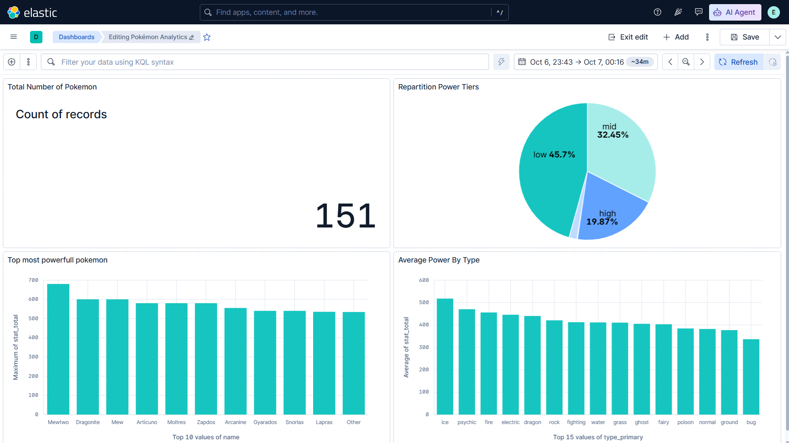
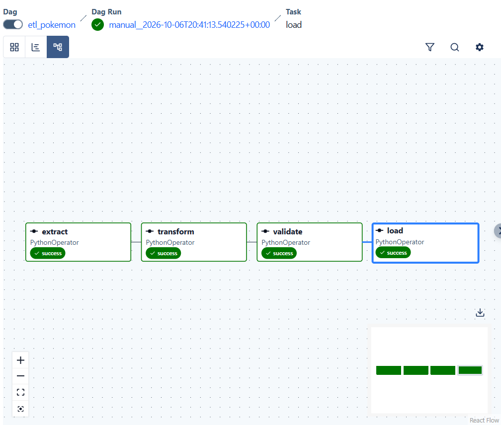

# Data Engineering Project — Pokémon ETL Pipeline

## Context

Automated ETL pipeline built with Apache Airflow that collects data from the
public PokeAPI (151 Pokémon from Gen 1), transforms it, validates it, loads it
into Elasticsearch and visualizes it in Kibana.

## Architecture

```
PokeAPI (JSON) → Airflow (extract → transform → validate → load) → Elasticsearch → Kibana
```

## Data source

- API: PokeAPI (https://pokeapi.co)
- Endpoint: `/api/v2/pokemon?limit=151`
- No API key required

## Applied transformations

1. Flatten the nested JSON into tabular rows
2. Drop duplicates on the ID
3. Cast and normalize data types
4. Create computed columns: `stat_total`, `power_tier`
5. Filter out invalid records

## Quality checks

- Dataset not empty and >= 100 rows
- `id` is unique and non-null
- Required fields are non-null
- Base stats within the range [1, 255]
- `stat_total` consistent with the sum of the stats

## Elasticsearch mapping

See `elasticsearch/mapping.json` — index `pokemon`.

## Analyses

- Top 10 most powerful Pokémon
- Distribution by power tier
- Average power by type
- Total number of Pokémon

> The aggregations are defined in `elasticsearch/queries.json`.

## Kibana dashboard

See `kibana/dashboard.ndjson` (import it via **Stack Management → Saved Objects → Import**).



## Airflow DAG



## Running the project

```bash
git clone <your-repo>
cd ge-it-projet-data-engineering
cp .env.mock .env
docker compose up -d --build
```

- Airflow: https://airflow.python-community.com (local: http://localhost:8016)
- Kibana: https://kibana.python-community.com (local: http://localhost:8017)

Activate the `etl_pokemon` DAG in the Airflow UI, then trigger it.

## Documentation

- `CHEATSHEET.md` — short command reference (quick copy-paste)
- `COMMANDS.md` — detailed commands, options and troubleshooting

## Author

Your Name

